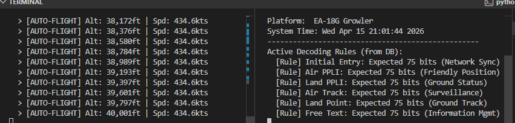

Virtual Track: Tactical Data Link (TDL) Simulator
Virtual Track is a high-fidelity flight simulation and tactical data decoding pipeline designed for Tactical Edge environments. The system leverages the AirSim (Colosseum) Physics Engine to simulate an EA-18G Growler electronic warfare platform, generating real-time telemetry that is processed through a decoupled ETL pipeline and decoded via a MIL-STD-6016 J-Series terminal.

Project Overview
This project demonstrates the ability to bridge high-speed physics simulations with structured military data standards. It features a completely decoupled architecture where flight physics, data spoofing, and command-and-control (C2) interfaces operate as independent nodes.

Key Features:
High-Fidelity Physics Surrogate: Utilizes AirSim/Unreal Engine 4 to simulate autonomous flight patterns (North-East Climbing vectors).

Tactical Telemetry Scaling: Custom algorithms translate low-level drone physics into Mach-speed tactical profiles (Alt: 40,000ft+ | Spd: 430kts+).

Regex-Driven ETL Pipeline: An automated scraper that parses raw interface control documents (ICDs) into structured JSON formats.

SQLite Backend: Persistent storage for J-Series decoding rules, allowing for real-time data-joins during live flight.

Bulletproof Handshaking: Implementation of graceful teardown logic and RPC timeout management to ensure system stability and prevent network port contention.

System Architecture
The project is divided into four distinct engineering nodes:

The Physics Engine (AirSim/Blocks.exe): Provides the raw environmental and kinematic data.

The TDL Spoofer (flight_spoofer.py): Acts as the on-board computer. It captures drone coordinates, applies scaling factors for a Growler platform, and streams data to a JSON bridge.

The ETL Scraper & Loader (wicked_scraper.py / db_loader.py): Parses mock_cmn4_spec.txt using complex Regular Expressions and populates the wicked_tactical.db with MIL-STD J-Series rules.

The C2 Terminal (wicked_terminal.py): The final interface that reads the live stream, queries the SQLite database, and presents a synchronized tactical display.

Tech Stack
Language: Python 3.x

Simulator: AirSim (Colosseum) / Unreal Engine 4

Database: SQLite3

Data Pipelining: JSON, Regex (Regular Expressions)

Communication: RPC (Remote Procedure Call) over TCP/IP

Installation & Usage
1. Environment Setup
PowerShell
# Clone the repository

# Initialize virtual environment
python -m venv .venv
.\.venv\Scripts\Activate.ps1

# Install dependencies
pip install airsim
2. The ETL Pipeline
Before launching the flight, ingest the tactical specifications:

PowerShell
python wicked_scraper.py
python db_loader.py
3. Execution
Launch Blocks.exe (The Simulation Environment).

Run the Flight Spoofer: python flight_spoofer.py

Run the Tactical Terminal: python wicked_terminal.py

Tactical Data Link (TDL) Logic
Virtual Track supports the following J-Series message types as defined in the database:

J0.0: Initial Entry (Network Sync)

J2.2: Air PPLI (Friendly Position)

J3.2: Air Track (Surveillance)

J28.2: Free Text (Information Mgmt)

Engineering Challenges Overcome
RPC Port Contention: Solved Zombie Python processes by implementing a finally block teardown and taskkill automation.

Relative Path Paradox: Implemented os.path.abspath logic to ensure database connectivity regardless of the execution directory.

Data Integrity: Developed a robust Regex pattern to handle tabular pipe-delimited (|) specifications from raw text documents.